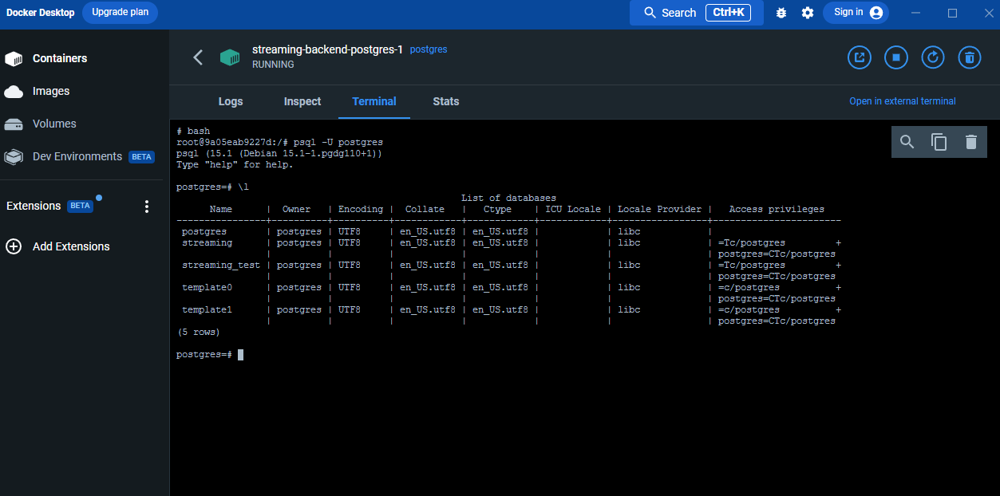

# Full Stack Nanodegree Web Competition

## Team Member

- MiDO Mostafa
- Gamal Mohamed Haroum
- Ahmed Hany
- Mohammed Mahmoud Khairy Mostafa
- Neveen Samir

---

## Setup

1- Fill in .env file like in the .env.example. Here is mine

```
POSTGRES_USER='postgres'
POSTGRES_HOST='127.0.0.1'
POSTGRES_DB_NAME='streaming'
POSTGRES_TEST_DB_NAME='streaming_test'
POSTGRES_PASSWORD='password'
JWT_SECRET="secret"
BCRYPT_SECRET="secret"
ENV='dev'
PORT=3000
DB_PORT=5432
TEST_DB_PORT=5433
SALT_ROUNDS=10
```

Of course you omit `.example` from the filename.

2- Setup Docker

```
docker-compose up -d
```

to create a container and run it as a daemon. The docker compose will also run the `01-database.sql` file found in `docker/init` directory to create the database and grant all priveleges to the user.



3- Run

```
yarn run build
```

```
yarn start
```

---

## Database Schema

_Based on the requirements below_

### `users` table

| column name | type         | attriutes            |
| ----------- | ------------ | -------------------- |
| id (PK)     | uuid         | generated by default |
| email       | VARCHAR(100) | not null             |
| password    | VARCHAR(100) | not null             |

### `movies` table

| column name  | type         | attriutes                      |
| ------------ | ------------ | ------------------------------ |
| id (PK)      | uuid         | generated by default           |
| name         | VARCHAR(100) | not null                       |
| release_date | date         | not null, DEFAULT CURRENT_DATE |

### `watch_list` table

| column name     | type | attriutes                       |
| --------------- | ---- | ------------------------------- |
| watch_list_pkey | uuid | PRIMARY KEY (user_id, movie_id) |
| user_id         | uuid | Foreign Key, ON UPDATE CASCADE  |
| movie_id        | uuid | Foreign Key, ON UPDATE CASCADE  |

---

## API

- POST /api/users => sign-up (create functionality)
- GET /api/users => get all users (get functionality)
- PUT /users/:userID => update user's account (update functionality)
- DELETE /users/:userID => delete user's account (delete functionality)
- GET /users/:userID => get user's account (show functionality)

---
