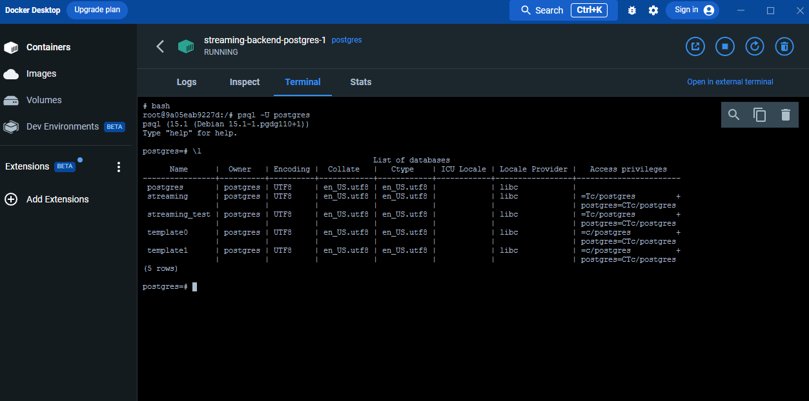

# Full Stack Nanodegree Web Competition

## Setup

## Team Member

- MiDO Mostafa
- Gamal Mohamed Haroum
- Ahmed Hany
- Mohammed Mahmoud Khairy Mostafa
- Neveen Samir

---

## Setup

1- Fill in .env file like in the .env.example. Here is mine

```
POSTGRES_USER='postgres'
POSTGRES_HOST='127.0.0.1'
POSTGRES_DB_NAME='streaming'
POSTGRES_TEST_DB_NAME='streaming_test'
POSTGRES_PASSWORD='password'
JWT_SECRET="secret"
BCRYPT_SECRET="secret"
ENV='dev'
PORT=3000
DB_PORT=5432
TEST_DB_PORT=5433
SALT_ROUNDS=10
```

Of course you omit `.example` from the filename.

2- Setup Docker

```
docker-compose up -d
```

to create a container and run it as a daemon. The docker compose will also run the `01-database.sql` file found in `docker/init` directory to create the database and grant all priveleges to the user.



3- Run

```
yarn run build
```

```
yarn start
```

---

## Database Schema

_Based on the requirements below_

### `users` table

| column name | type         | attriutes            |
| ----------- | ------------ | -------------------- |
| id (PK)     | uuid         | generated by default |
| email       | VARCHAR(100) | not null             |
| password    | VARCHAR(100) | not null             |

### `movies` table

| column name  | type         | attriutes                      |
| ------------ | ------------ | ------------------------------ |
| id (PK)      | uuid         | generated by default           |
| name         | VARCHAR(100) | not null                       |
| release_date | date         | not null, DEFAULT CURRENT_DATE |

### `watch_list` table

| column name     | type | attriutes                       |
| --------------- | ---- | ------------------------------- |
| watch_list_pkey | uuid | PRIMARY KEY (user_id, movie_id) |
| user_id         | uuid | Foreign Key, ON UPDATE CASCADE  |
| movie_id        | uuid | Foreign Key, ON UPDATE CASCADE  |

---

## API

- User:
  - POST /api/users => sign-up (create functionality)
  - GET /api/users => get all users (get functionality)
  - PUT /users/:userID => update user's account (update functionality)
  - DELETE /users/:userID => delete user's account (delete functionality)
  - GET /users/:userID => get user's account (show functionality)
- Movie:
  - POST /api/movies => create movie (create functionality)
  - GET /api/movies => get all movies (get functionality)
  - PUT /movies/:movieID => update movie (update functionality)
  - DELETE /movies/:movieID => delete movie (delete functionality)
  - GET /movies/:movieID => get a movie (show functionality)
- Watch List:
  - POST /api/users/:userID/movies => create user's watch list (create functionality)
  - GET /api/users/:userID/movies => get user's watch list (create functionality)
  - DELETE /api/users/:userID/movies => delete user's watch list (delete functionality)
  - GET /api/users/:userID/movies/:movieID => get a movie user's watch list (show functionality)
  - PUT /api/users/:userID/movies/:movieID => append to a user's watch list (update functionality)
  - DELETE /api/users/:userID/movies/:movieID => delete a movie in a user's watch list (delete functionality)

---

## Directory Structure:

```bash
├───common: Contains common modules.
├───db: Handles database queries logic.
├───models: Defines database schema entities.
├───routes: Defines routes and middleware.
│   └───controllers: Handles logic coming from routes.
├───services: Handles logic that spans two databases entities.
└───tests: Defines tests
```

---

#### Egypt-FWD T3C16 - January 23 Cohort

<br>
This repository will act as a guideline for your team to work on the group activity.
<br>
<br>

The objective of this competition is purely dedicated to have you experience working as part of a team to develop a basic CRUD application as a practice for yourselves and for the project of the nanodegree.

## Streaming Application

You are going to model a database for a streaming service application and develop the server-side application connected to the database.

The database models should be simple and not over-engineered for the purposes of the activity. The database should be composed of the following entities:

- Movies
- Users
- User List

You should create APIs for every entity as per the RESTful guidelines. These APIs should be:

- get() --> Retrieve all records of the entity.
- show() --> Retrieve single record for a specific entity through an id, name or email.
- create() --> Create a new record for the entity.
- delete() --> Delete a record of the entity.
- update() --> Modify record data of an entity.

You should also create at least 3 test cases for your endpoints to show that they work as required to. These test cases should at least have one successful and one failing test.

### Database Schema

The schema proposed is the minimal requirement for your submission but any additions is up to you. It is recommended that you follow the schema and fulfill the requirements needed prior to making additional changes.

### Movies Entity

The movies entity should include the following attributes:

- id
- name
- release date

### Users Entity

The users entity should include the following attributes:

- id
- email
- password

### User Watch List

The user list should map a many-to-many relationship defining the movies a user would want to watch. You can also add an attribute to log if the user has watched this movie yet or not. You can draw up your own schema but don't forget that it should map a many-to-many relationship between the users and the movies entity.

## Submission Method

You are going to be working as teams and below are the guidelines for submitting your work:

- Fork the repository then clone it to start working on the activity.
- Follow your SL's instructions on how to send your submission during the session.

## Grading Scheme

You are going to be receiving feedback based on the following criteria:

- Functionality.
- Project hierarchy and structure.
- Clean code.
- Test cases.
